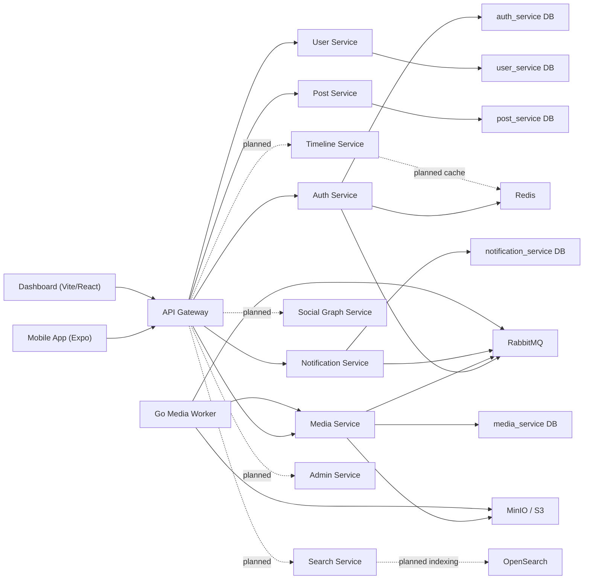
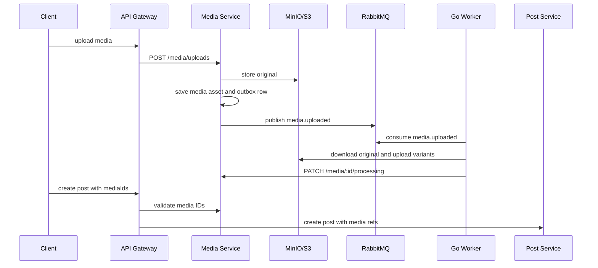
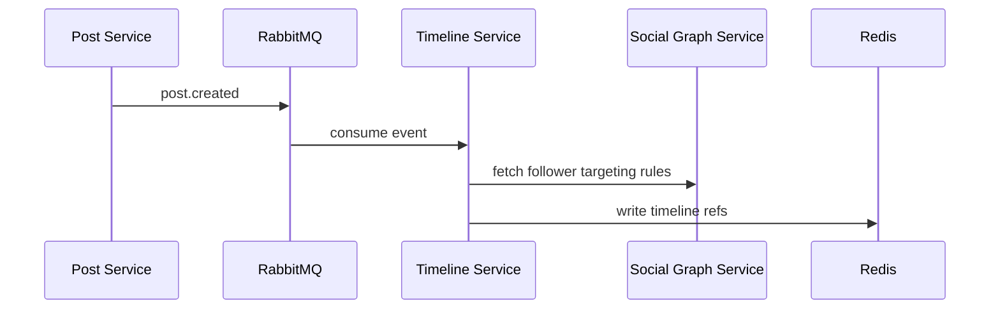
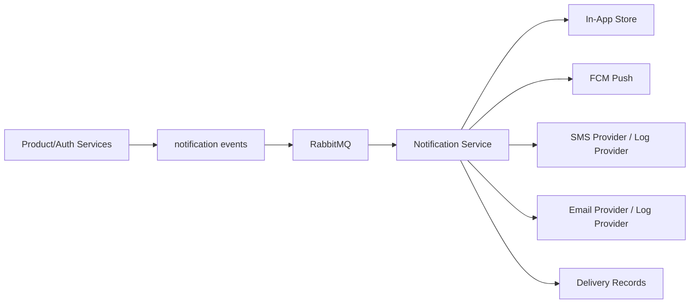

# X Clone Microservices System Design

Last audited: 2026-07-01

This document describes the intended architecture and calls out what is implemented today. For the checklist view, see `progress-tracker.md`.

## Goal

Build an X-like social platform as a microservices-based system for:

- product delivery
- hands-on distributed-systems learning
- load testing and scale experiments

The target stack remains:

- Node.js and Fastify for core APIs.
- Go for CPU-heavy media processing.
- PostgreSQL for durable service-owned data.
- Redis for OTPs, rate limits, cache, and future timeline hot paths.
- RabbitMQ for events and work queues.
- MinIO/S3-compatible storage for media.
- OpenSearch for future search.
- Expo/React Native for mobile.
- React/Vite for dashboard/admin.

Target scale is still a path toward `100k concurrent users`, but the current repo is an early-to-mid implementation, not a production system.

## Current Architecture Reality

Implemented now:

- API gateway as the public backend entry point.
- Internal Fastify services protected by `INTERNAL_SERVICE_SECRET` for non-health routes where feature routes exist.
- Separate service databases configured through separate Postgres database URLs in local Docker Compose.
- Shared Zod contract package for DTO/event shapes.
- RabbitMQ event paths for auth OTP notifications and media processing.
- MinIO media storage and Go media processing worker.
- Notification service with in-app, push, SMS-log, and email-log channel handlers.

Not implemented yet:

- Social graph business APIs.
- Timeline/feed generation.
- Search indexing and query APIs.
- Admin/moderation workflows.
- Full observability stack.
- Production-grade event catalog, idempotency, and retry policy across every event family.

## High-Level Architecture

## Service Design

### API Gateway

Current responsibilities:

- Public auth routes: OTP request/verify, refresh, logout.
- Current user routes: `/me`, `/me/profile`.
- Post routes: create/list/get/delete.
- Media routes: upload, list by ID, stream original/variants.
- Notification routes: device installation registration, in-app list/read.
- JWT access-token validation for protected public routes.
- Internal HTTP forwarding with `INTERNAL_SERVICE_SECRET`.

Remaining responsibilities:

- Social graph, timeline, search, and admin route exposure.
- Edge rate limiting.
- Correlation ID propagation.
- More careful response aggregation where client screens need multiple sources.

### Auth Service

Current responsibilities:

- OTP request/verify.
- Redis OTP TTL storage and attempts.
- Redis OTP rate limiting.
- JWT access tokens.
- Refresh-token sessions, rotation, reuse detection, and logout.
- User bootstrap through user-service.
- Publish OTP notification events to RabbitMQ.

Remaining responsibilities:

- Real production SMS provider integration such as MSG91.
- Admin auth/roles.
- Account/session management endpoints.
- Security audit events.

### User Service

Current responsibilities:

- Bootstrap user profile by phone number.
- Read user by ID.
- Update handle, display name, bio, and avatar URL.
- Own `users` table.

Remaining responsibilities:

- Public profile reads.
- Avatar upload flow.
- Settings/privacy fields.
- User lifecycle events.
- Profile search integration.

### Post Service

Current responsibilities:

- Own canonical post storage.
- Create, list, get, and soft-delete posts.
- Store reply/repost references.
- Store post media references and enforce basic media limits.

Remaining responsibilities:

- Publish post domain events.
- Full repost/quote/like/bookmark/reply behavior.
- Counters and visibility/moderation states.
- Timeline/search/notification integration.

### Media Service and Go Worker

Current responsibilities:

- Accept uploads through the gateway.
- Store originals in MinIO/S3-compatible storage.
- Persist media assets, variants, and event outbox records.
- Stream original and variant files.
- Let Go worker consume `media.uploaded`, process images/videos, upload variants, and report processing status.
- Use RabbitMQ retry and dead-letter handling in the worker.

Remaining responsibilities:

- Direct presigned upload flow.
- Reliable outbox dispatcher lifecycle and visibility.
- CDN-ready URL strategy.
- Media safety checks, quotas, and cleanup.
- Processing state UI.

### Notification Service

Current responsibilities:

- Own device installations, notifications, and delivery records.
- Register device installations.
- List and mark in-app notifications read.
- Consume RabbitMQ notification events.
- Resolve notification definitions and fan out to channels.
- Support in-app, FCM push, SMS-log, and email-log channels.

Remaining responsibilities:

- Notification preferences.
- Retry/DLQ strategy for notification events.
- Stronger idempotency tracking.
- Real SMS/email providers.
- Product event producers for follow/like/reply flows.

### Social Graph Service

Current status: scaffold.

Planned responsibilities:

- Follow/unfollow.
- Block/mute.
- Follower/following counts.
- Follower targeting APIs for timeline fanout.
- Graph events such as `user.followed`.

### Timeline Service

Current status: scaffold.

Planned responsibilities:

- Home timeline reads.
- Redis-backed timeline cache.
- Fanout-on-write for normal users.
- Fanout-on-read for large accounts.
- Post hydration strategy.
- Feed pagination and ranking hooks.

### Search Service

Current status: scaffold.

Planned responsibilities:

- Consume user/post events.
- Index users, posts, and hashtags into OpenSearch.
- Serve search query endpoints.
- Hide OpenSearch internals from the rest of the system.

### Admin Service and Dashboard

Current status: scaffold.

Planned responsibilities:

- Abuse reports.
- Moderation queues and actions.
- Admin roles.
- Audit logs.
- Dashboard APIs and UI workflows.

## Communication Patterns

### Synchronous HTTP

Current use:

- Gateway to auth/user/post/media/notification services.
- Auth service to user-service for user bootstrap.
- Go media worker to media-service for processing updates.

Rules:

- Clients talk to the gateway, not directly to internal services.
- Services should not write into another service's database.
- Gateway should route and compose, not own core business logic.

### Asynchronous Events

Current use:

- Auth service publishes OTP notification events.
- Notification service consumes notification events.
- Media service publishes `media.uploaded`.
- Go worker consumes media events and handles retry/DLQ.

Planned events:

- `user.created`
- `user.profile.updated`
- `user.followed`
- `user.unfollowed`
- `post.created`
- `post.deleted`
- `post.liked`
- `media.uploaded`
- `media.processed`
- `notification.requested`
- `report.created`

The next design task is to write an event catalog that names producer, consumer, routing key, schema, idempotency key, retry policy, and DLQ behavior for each event.

## Data Ownership

Local development uses one Postgres container with separate databases per service:

- `api_gateway`
- `auth_service`
- `user_service`
- `social_graph_service`
- `post_service`
- `timeline_service`
- `notification_service`
- `search_service`
- `admin_service`
- `media_service`

Rules:

- A service owns its own tables.
- Cross-service reads happen through APIs or events.
- Direct cross-service table writes are not allowed.
- Shared contracts can define DTOs/events, but should not become shared business logic.

## Media Pipeline

Current caveat: upload currently passes through the gateway/service as request payload. The target design is a presigned/direct upload flow.

## Timeline Strategy

The intended strategy is still hybrid:

- fanout-on-write for regular users
- fanout-on-read for high-follower accounts

Current status: not implemented beyond the timeline service scaffold.

Planned flow:

## Notification Architecture

Current implementation already supports the internal event consumer, in-app persistence, delivery records, FCM push, and log SMS/email providers. Preferences, retries, DLQ handling, and real SMS/email providers are still future work.

## Observability

Current status: basic service logs only.

Required before serious load testing:

- request IDs at gateway entry
- correlation IDs through internal HTTP and RabbitMQ messages
- OpenTelemetry traces
- service metrics
- queue depth and consumer lag dashboards
- DB slow query visibility
- structured error reporting

## Load Testing Plan

Scenarios to build:

- OTP storm.
- Post creation burst.
- Timeline read pressure.
- Celebrity post fanout.
- Notification spike.
- Media ingestion and processing burst.

Tools:

- k6 or Locust for HTTP load.
- Prometheus/Grafana for metrics once observability is added.
- RabbitMQ management metrics for queue behavior.

## Service Boundary Rules

1. Each service owns its data.
2. No direct writes to another service's tables.
3. API gateway stays thin.
4. Cross-service side effects should prefer events.
5. Event consumers must become idempotent.
6. Every production-grade async flow needs retry and DLQ behavior.
7. Observability is part of the architecture, not a later polish task.
