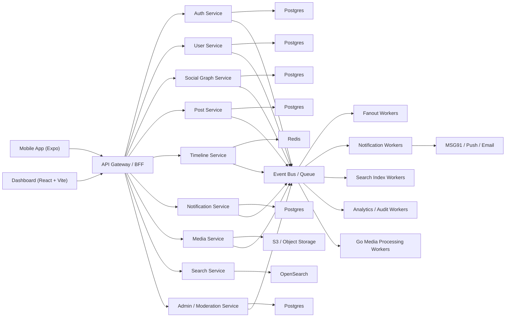
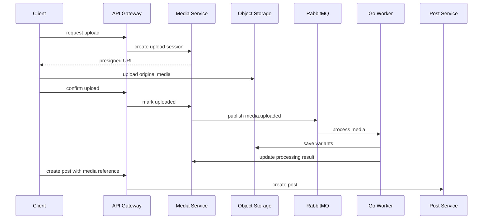
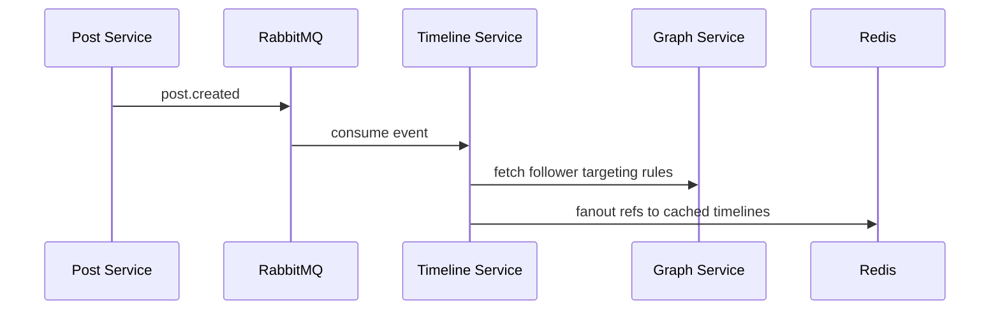
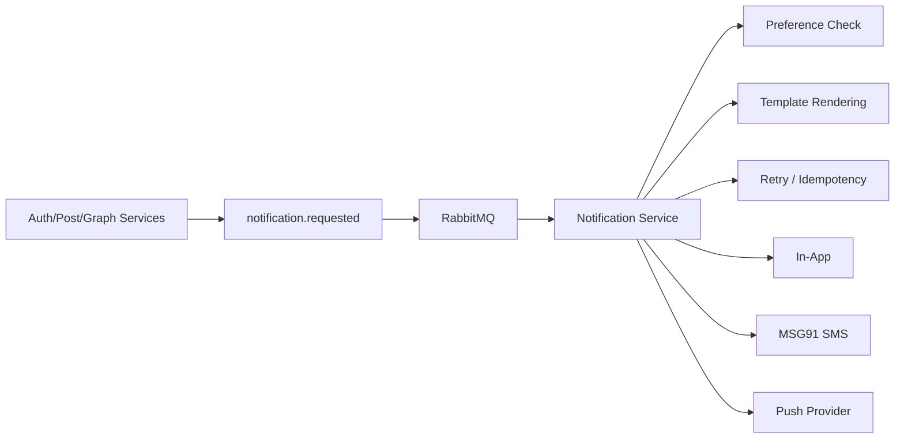

# X Clone Microservices System Design

## 1. Goal

Build an X-like social platform as a **microservices-based system** for both:

- product delivery
- hands-on learning of distributed architecture
- load testing and scale experimentation

Target stack:

- `Node.js` for core APIs and orchestration-heavy services
- `Go` for media and CPU-heavy pipelines
- `PostgreSQL` for durable data
- `Redis` for cache, rate limits, ephemeral state, and some queue support
- `React + Vite` for the admin/dashboard
- `Expo + React Native` for the mobile app

Target scale:

- design with a path toward `100k concurrent users`

This document assumes you **want microservices on purpose**, not because they are automatically better.

## 2. Important Reality Check

Microservices do **not** magically give scalability by themselves.

What they actually give you is:

- isolated deployments
- independent scaling per service
- failure isolation
- clearer ownership boundaries
- technology flexibility

What they cost you:

- network calls instead of in-process calls
- harder debugging
- eventual consistency
- more infrastructure
- more observability requirements
- harder local development

So if you are doing this to learn, that is a very good reason. Just make sure you learn the tradeoffs too, not only the benefits.

## 3. Recommended Learning-First Microservice Style

Do **not** build 20 tiny services.

Instead, build **domain-sized microservices**:

1. `api-gateway`
2. `auth-service`
3. `user-service`
4. `social-graph-service`
5. `post-service`
6. `timeline-service`
7. `notification-service`
8. `media-service`
9. `search-service`
10. `admin-moderation-service`

Then add supporting infrastructure:

- `Redis`
- `PostgreSQL`
- `queue/event bus`
- `object storage`
- `OpenSearch`
- `observability stack`

This is enough to teach you the real microservice patterns without becoming a distributed mess.

## 4. High-Level Architecture



## 5. Industry-Oriented Architecture Recommendation

If the goal is a serious social platform, a good industry-style structure is:

- synchronous request path kept thin
- asynchronous event-driven processing for expensive side effects
- each service owns its own data
- shared infrastructure, not shared service internals

That means:

- APIs call the service responsible for the requested action
- services publish events when state changes
- downstream services react asynchronously

Example:

- `post-service` creates a post
- emits `post.created`
- `timeline-service` fans out timeline references
- `search-service` indexes the post
- `notification-service` sends notifications if needed

That is the microservice pattern you should learn early.

## 6. Service-by-Service Design

## 6.1 API Gateway

Responsibilities:

- single entry point for mobile and dashboard
- auth verification
- request routing
- response aggregation where necessary
- rate limiting at the edge
- versioning

Why it exists:

- clients should not know every internal service directly
- central place for auth, throttling, and cross-cutting concerns

Suggested stack:

- `Node.js`
- `Fastify` or `NestJS`
- optional `Envoy` or `NGINX` in front later

## 6.2 Auth Service

Responsibilities:

- signup/login
- phone OTP
- refresh token lifecycle
- device/session management
- admin auth

Data:

- users auth credentials
- sessions
- OTP challenges

Notes:

- production OTP via `MSG91`
- development mode logs OTP to console
- store OTP challenge state in Redis with TTL

Why separate it:

- auth is security-sensitive
- rate limiting and abuse controls are special
- easier to harden independently

## 6.3 User Service

Responsibilities:

- user profile
- avatar reference
- bio
- settings
- privacy flags

Why separate it from auth:

- auth lifecycle and profile lifecycle evolve differently
- easier to keep security logic isolated

## 6.4 Social Graph Service

Responsibilities:

- follow/unfollow
- followers/following counts
- blocks
- mutes

Why separate it:

- graph data is hot and highly connected
- it becomes a core dependency for feed generation and recommendations

## 6.5 Post Service

Responsibilities:

- create/edit/delete posts
- replies
- reposts
- quote posts
- post metadata
- post-media references

Why separate it:

- post creation is the center of the domain
- it emits important downstream events

Important rule:

- this service stores the canonical post
- downstream services must not invent their own truth for the post body

## 6.6 Timeline Service

Responsibilities:

- home timeline assembly
- timeline caching
- hybrid fanout strategy
- feed ranking hooks

Why separate it:

- timelines are a read-optimized concern
- feed generation changes independently from post storage

This is one of the most important scalability services in the whole system.

## 6.7 Notification Service

Responsibilities:

- in-app notifications
- push notifications
- SMS notifications
- email later if needed
- user notification preferences
- template rendering
- retries and delivery records

Why separate it:

- provider integrations fail in different ways
- retries and idempotency matter
- channel routing should not live in product services

## 6.8 Media Service

Responsibilities:

- upload orchestration
- presigned upload URLs
- media metadata
- storage lifecycle
- processing status

Go workers handle:

- image resizing
- video transcoding
- thumbnails
- metadata extraction

Why separate it:

- media is operationally very different from normal API traffic
- large files and CPU-heavy jobs need different scaling

## 6.9 Search Service

Responsibilities:

- indexing posts and users
- search query endpoints
- ranking/tuning hooks

Why separate it:

- search infra and query patterns are distinct
- OpenSearch should not leak across the rest of the system

## 6.10 Admin / Moderation Service

Responsibilities:

- abuse reports
- review queues
- moderation actions
- audit logs
- admin dashboards

Why separate it:

- platform safety must be auditable
- admin permissions should be tightly controlled

## 7. Communication Patterns

Use **both** synchronous and asynchronous communication.

## 7.1 Synchronous

Use HTTP/gRPC for:

- immediate request/response behavior
- fetching data the client needs now
- authorization checks

Examples:

- gateway to auth-service
- gateway to post-service
- timeline-service to social-graph-service for specific reads if necessary

## 7.2 Asynchronous

Use queue/event bus for:

- timeline fanout
- search indexing
- notifications
- audit trails
- analytics
- media processing

Examples of domain events:

- `user.created`
- `user.profile.updated`
- `user.followed`
- `post.created`
- `post.deleted`
- `post.liked`
- `media.uploaded`
- `media.processed`
- `notification.requested`
- `report.created`

## 8. Event Bus Recommendation

Since you want to learn microservices seriously, choose one of these paths:

### Option A: RabbitMQ

Best if you want to learn:

- routing
- retries
- DLQs
- work queues
- event consumers

Good for your current project.

### Option B: Kafka

Best if you want to learn:

- event streaming
- consumer groups
- durable replay
- analytics/event-driven pipelines

But:

- much heavier operationally
- more complex for a first large project

### My recommendation

Start with:

- `RabbitMQ` for service events and work queues

Reason:

- it teaches real distributed messaging
- easier to operate than Kafka
- very suitable for notifications, fanout, and media processing jobs

## 9. Database Strategy

For a true microservice architecture, each service should **own its own database schema**.

That does not always mean a completely separate physical Postgres cluster at first.

A realistic learning setup is:

- one Postgres server
- separate databases or schemas per service

Example:

- `auth_db`
- `user_db`
- `graph_db`
- `post_db`
- `notification_db`
- `admin_db`

Why:

- you learn ownership boundaries
- you avoid direct table coupling
- you can still run locally without huge infra cost

Important rule:

- one service never writes directly into another service's tables

That rule matters more than whether the physical server is shared.

## 10. Redis Strategy

Use Redis for:

- OTP TTL storage
- rate limiting
- session acceleration
- timeline cache
- hot counters if needed
- idempotency keys
- distributed locks sparingly

Do not use Redis as the permanent source of truth for core social data.

## 11. Media Pipeline



Why this design is strong:

- API servers do not stream giant files
- media processing is decoupled
- Go workers scale independently

## 12. Timeline Strategy

Timeline is where scalability lessons become real.

Use a **hybrid timeline system**:

- fanout-on-write for regular users
- fanout-on-read for celebrity/high-follower accounts

### Why

If every post from a huge creator is pushed to millions of followers immediately, write amplification becomes painful.

But if you build every user's feed from scratch on every request, reads become painful.

So the hybrid model gives you:

- fast reads for most users
- protection from explosive writes for very large accounts

### Timeline data flow



## 13. Notification Architecture



Why this matters:

- product services only request notifications
- notification-service owns delivery logic
- failures are isolated
- retries do not leak into product APIs

## 14. Scalability Discussion

## What microservices improve

- you can scale timeline-service without scaling auth-service
- media workers can scale independently from post APIs
- a notification spike does not require scaling every backend
- deployments affect smaller surfaces

## What microservices do not automatically solve

- bad database queries
- poor timeline strategy
- missing caching
- lack of backpressure
- bad event design

The biggest scalability wins in social apps usually come from:

- cache design
- async processing
- storage strategy
- feed architecture
- indexing and search architecture

Microservices help when those concerns need independent scaling and isolation.

## 15. Load Testing Plan

Since learning through load testing is one of your goals, test these scenarios:

### Scenario 1: OTP storm

- many concurrent login requests
- validate Redis rate limiting
- validate MSG91 isolation

### Scenario 2: Post creation burst

- many users posting at once
- validate post-service latency
- validate event bus throughput

### Scenario 3: Timeline read pressure

- many users refreshing the home feed
- validate Redis hit ratio
- validate timeline-service latency

### Scenario 4: Celebrity post

- one large user posts
- validate fanout strategy
- compare write amplification vs read assembly

### Scenario 5: Notification spike

- reply/like/follow storms
- validate notification queue backlog
- validate retry behavior

### Scenario 6: Media ingestion

- many concurrent image/video uploads
- validate object storage flow
- validate Go worker throughput

Suggested tools:

- `k6`
- `Locust`
- `Grafana`
- `Prometheus`

## 16. Observability Stack

You cannot properly learn microservices without observability.

Use:

- `OpenTelemetry`
- `Prometheus`
- `Grafana`
- `Loki` or ELK
- `Sentry`

You should be able to answer:

- which service is slow
- which queue is backed up
- which event is failing
- how long timeline generation takes
- how long media processing takes

Without that, microservices become guesswork.

## 17. Suggested Tech Choices

## Backend services

Choose one of these:

- `NestJS` for structured service code
- `Fastify` for lightweight high-performance services

### My recommendation

For your learning objective:

- `NestJS` for most Node services
- `Go` for media workers

Why:

- NestJS makes boundaries, modules, DTOs, and service structure easier to keep clean
- you will learn architecture patterns faster

## Infra choices

- `RabbitMQ` for async messaging
- `PostgreSQL`
- `Redis`
- `OpenSearch`
- `S3-compatible object storage`
- `Docker Compose` for local development
- `Kubernetes` later if you want orchestration learning

## 18. Monorepo Layout

```text
apps/
  api-gateway/
  auth-service/
  user-service/
  social-graph-service/
  post-service/
  timeline-service/
  notification-service/
  search-service/
  admin-service/
  mobile/
  dashboard/
  docs/

services/
  media-service/          # Go API/orchestrator if separate
  media-worker/           # Go workers

packages/
  contracts/              # shared DTOs/events only, keep minimal
  config/
  observability/
  ui/
  eslint-config/
  typescript-config/

infra/
  docker/
  rabbitmq/
  postgres/
  redis/
  opensearch/
  monitoring/

docs/
  system-design.md
  implementation-roadmap.md
```

## 19. Service Boundary Rules

To make this a real microservice architecture, follow these rules:

1. each service owns its schema/data
2. no direct table access across services
3. all service APIs are explicit
4. side effects happen through events where possible
5. each service is deployable independently
6. each service has health checks, logs, metrics, and tracing

If you break these rules, you may have many repos/apps but not real microservices.

## 20. Final Recommendation

If your goal is to learn microservices deeply, this project is a good fit.

The best version of that learning journey is:

- use domain-sized services, not tiny services
- use RabbitMQ early
- keep separate service-owned schemas
- rely on events for side effects
- put serious effort into observability
- load test the system and compare bottlenecks

That will teach you:

- service boundaries
- synchronous vs asynchronous design
- eventual consistency
- failure isolation
- scaling behavior
- operational complexity

And that is the real value of microservice architecture.
